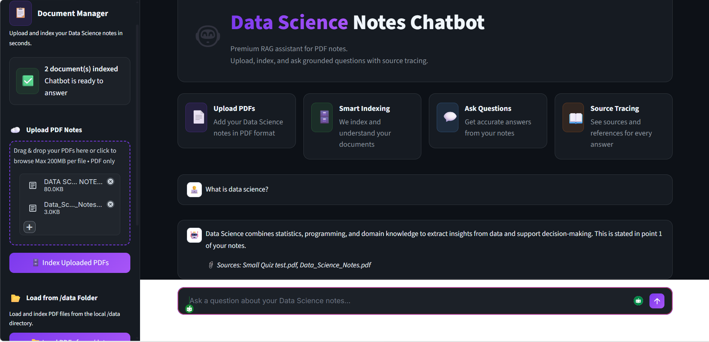
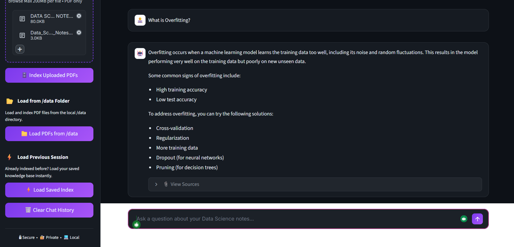

# 🤖 Data Science Notes Chatbot

An AI-powered chatbot that answers questions from your Data Science 
notes - built with LangChain, Groq, ChromaDB & Streamlit.

## Features
- 📄 **Upload PDF notes** - supports multiple files at once
- 🧠 **Semantic search** - finds relevant content using vector embeddings
- 🤖 **AI-powered answers** - grounded only in your uploaded notes
- 📎 **Source citations** - every answer shows which document it came from
- 💾 **Persistent index** - ChromaDB saves to disk, reload without re-indexing
- 🎨 **Professional dark UI** - clean modern interface built with Streamlit
- ⚡ **Free to use** - powered by Groq API (no OpenAI credit card needed)

## 🛠️ Tech Stack

| Layer | Technology | Purpose |
|---|---|---|
| **UI** | Streamlit | Web interface |
| **LLM** | Groq (`llama-3.1-8b-instant`) | Answer generation |
| **RAG** | LangChain | Retrieval pipeline |
| **Vector DB** | ChromaDB | Storing embeddings |
| **Embeddings** | sentence-transformers (`all-MiniLM-L6-v2`) | Text → vectors |
| **PDF Parser** | pypdf | Extract text from PDFs |


## Project Structure
ds-notes-chatbot/
├── src/
│   ├── __init__.py
│   ├── chain.py
│   ├── embeddings.py
│   ├── pdf_loader.py
│   └── retriever.py
├── Data/
│   └── DATA SCIENCE NOTES.pdf
├── app.py
├── testapi.py
├── styles.css
├── utils.py
├── requirements.txt
├── .gitignore
└── README.md

## 🏗️ How It Works
PDF Notes → Text Extraction → Chunking → Embeddings → ChromaDB
↓
User Question → Embed Question → Similarity Search → Top Chunks
↓
Top Chunks + Question → Groq LLM → Answer

---

## 🚀 Quick Start

### 1. Clone the Repository
```bash
git clone https://github.com/YourUsername/ds-notes-chatbot.git
cd ds-notes-chatbot
```

### 2. Create Virtual Environment
```bash
python -m venv .venv

# Windows
.venv\Scripts\activate

# Mac/Linux
source .venv/bin/activate
```

### 3. Install Dependencies
```bash
python -m pip install --upgrade pip
python -m pip install streamlit python-dotenv pypdf langchain langchain-core langchain-community langchain-groq langchain-text-splitters chromadb sentence-transformers torch torchvision groq
```

### 4. Get Free Groq API Key
1. Go to 👉 https://console.groq.com
2. Sign up for free (no credit card)
3. Create an API key
4. Copy it

### 5. Configure Environment
Create a `.env` file in the project root:
```env
GROQ_API_KEY=your_groq_api_key_here
```

### 6. Test API Connection
```bash
python testapi.py
```
Expected output: 
✅ Groq API is working!
Response: Hello! How can I assist you today?

### 7. Run the App
```bash
streamlit run app.py
```
Open your browser at: **http://localhost:8501**

---

## 💬 How to Use

| Step | Action |
|---|---|
| **1** | Upload your PDF notes using the sidebar |
| **2** | Click **"Index Uploaded PDFs"** and wait |
| **3** | Ask any question in the chat input |
| **4** | Read the AI answer with source citations |
| **5** | Next time, click **"Load Saved Index"** to skip re-indexing |

### Example Questions
What is overfitting?
Explain logistic regression step by step.
What is the difference between precision and recall?
What is PCA and when should I use it?
Explain gradient descent.
What is cross validation?

---
## 📸 Demo

<table>
  <tr>
    <td align="center">
      <strong>🏠 Home Screen</strong><br/><br/>
      
    </td>
    <td align="center">
      <strong>💬 AI Answering Questions</strong><br/><br/>
      
    </td>
  </tr>
</table>
## 🔧 Troubleshooting

| Problem | Cause | Fix |
|---|---|---|
| App not opening | Wrong run command | Use `streamlit run app.py` not `python app.py` |
| `401 invalid_api_key` | Wrong/expired key | Regenerate at console.groq.com |
| `No PDFs found` | /data folder missing | Run `mkdir data` and add PDFs |
| `No module 'torchvision'` | Missing package | `pip install torchvision` |
| White text invisible | Browser cache | Press `Ctrl + Shift + R` |
| Blank UI | Port conflict | Run with `--server.port 8505` |

---

## 📦 Requirements
Python >= 3.11
streamlit
langchain
langchain-community
langchain-groq
chromadb
sentence-transformers
pypdf
python-dotenv
groq
torch
torchvision

---

## 🔒 Security

- ✅ API key stored in `.env` file only
- ✅ `.env` is in `.gitignore` — never committed
- ✅ All processing is local — your notes never leave your machine
- ✅ ChromaDB runs locally — no cloud database

> ⚠️ If your API key was ever exposed in a screenshot, 
> regenerate it immediately at https://console.groq.com/keys

---

## 🗺️ Roadmap

- [x] PDF upload and indexing
- [x] RAG pipeline with LangChain
- [x] Source citations
- [x] Persistent vector store
- [x] Professional dark UI
- [ ] OCR support for scanned PDFs
- [ ] Multi-language support
- [ ] Deploy to Streamlit Cloud
- [ ] Export chat history

---

## 👨‍💻 Author

**Your Name**
- GitHub: [Sotheara437](https://github.com/Sotheara437/Sotheara/blob/1c1bb70bd96d33f812bed6340c7fbf5828ccda2d/README.md#L4)
- LinkedIn: [Sam Sotheara](www.linkedin.com/in/sotheara-sam-277271340)

---

## 📄 License

This project is licensed under the MIT License.

---